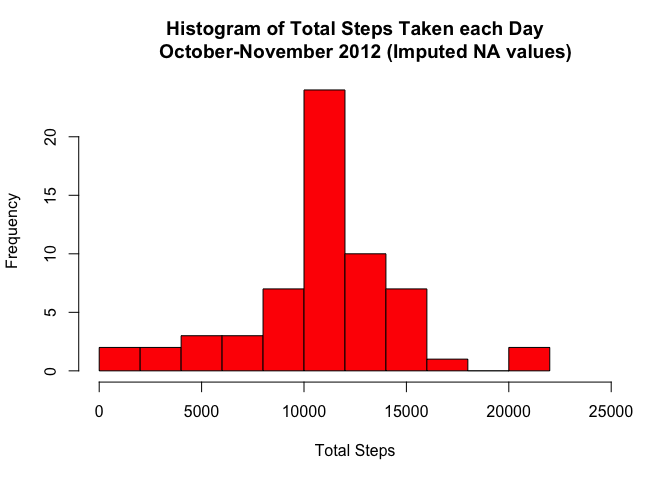

## Loading and preprocessing the data

```r
library(dplyr)
```

```
## 
## Attaching package: 'dplyr'
```

```
## The following objects are masked from 'package:stats':
## 
##     filter, lag
```

```
## The following objects are masked from 'package:base':
## 
##     intersect, setdiff, setequal, union
```

```r
library(ggplot2)
library(tidyr)
activity <- read.csv("activity.csv", header = TRUE)
activity$date <- as.Date(as.character(activity$date), format = "%Y-%m-%d")
activity$steps <- as.numeric(as.character(activity$steps))
activity$interval <- as.numeric(as.character(activity$interval))
```
## What is mean total number of steps taken per day?
# NA values were removed, so any days with NA values were not included in the following figure
*The 'zeroes' column is probably accounted for by the NA values.*

```r
steps_per_day <- activity %>% group_by(date) %>% summarise(sum(steps, na.rm = TRUE))
```

```
## `summarise()` ungrouping output (override with `.groups` argument)
```

```r
hist(steps_per_day$`sum(steps, na.rm = TRUE)`, breaks = 10, xlim = c(0, 25000),
    xlab = "Total Steps", main = "Histogram of Total Steps Taken each Day
    October-November 2012")
```

<!-- -->

```r
mean_spd <- mean(steps_per_day$`sum(steps, na.rm = TRUE)`)
median_spd <- median(steps_per_day$`sum(steps, na.rm = TRUE)`)
```

The mean number of steps taken each day, ignoring missing values was 9354.2295082 and the median was 1.0395\times 10^{4}.

## What is the average daily activity pattern?

```r
avg_interval_steps <- activity %>% group_by(interval) %>% summarise(mean(steps, na.rm = TRUE))
```

```
## `summarise()` ungrouping output (override with `.groups` argument)
```

```r
names(avg_interval_steps) <- c("interval", "average steps")

g <- ggplot(avg_interval_steps, aes(interval, `average steps`) )
g  + geom_line(col = "blue", lwd = .3) + xlab("5 Minute Intervals (Over 24 hrs.) ") + ylab("Average Number of Steps")+
    labs(title = "Steps Taken for each 5 Minute Interval in 24 Hours ", subtitle = "Average for Equivalent 5 Minute Intervals over 2 Months")
```

<!-- -->

```r
max_steps <- avg_interval_steps[avg_interval_steps$`average steps`==max(avg_interval_steps$`average steps`),]
max_steps_interval <- max_steps[1,1] 
max_steps <- max_steps[1,2]
```

On average, across all of the days in the dataset, the 5-minute interval at 835 contains the maximum number of steps, 206.1698113.

## Imputing missing values


```r
mv_count <- sum(is.na(activity$steps))

#replace NAs with mean average for that 5 minute interval
activity_nmv <- activity # new dataset with replaced NAs
steps_vector <- activity_nmv$steps

for (i in 1:length(steps_vector)){
    
   if(is.na(steps_vector[i])){
       
      interval_val <- activity_nmv$interval[i]
      
    mean_val <- subset(avg_interval_steps, avg_interval_steps$interval == interval_val)
    mean_val <- as.numeric(mean_val[1,2])
    
    activity_nmv$steps[i] <- coalesce(activity_nmv$steps[i], mean_val) 
   }
    
    
} 

steps_no_NA <- activity_nmv %>% group_by(date) %>% summarise(sum(steps))
```

```
## `summarise()` ungrouping output (override with `.groups` argument)
```

```r
hist(steps_no_NA$`sum(steps)`, breaks = 10, xlim = c(0, 25000),
    xlab = "Total Steps", main = "Histogram of Total Steps Taken each Day
    October-November 2012 (Imputed NA values)", col = "red")
```

<!-- -->

```r
mean_new <- mean(steps_no_NA$`sum(steps)`)
median_new <- median(steps_no_NA$`sum(steps)`)
```

There are 2304 missing values in the dataset.(i.e. total number of rows with NAs)

The mean total steps each day is now 1.0766189\times 10^{4} and the updated median is 1.0766189\times 10^{4}.

Imputing the NA values has the effect of increasing both the mean average and the median as any rows
with NA values were previously evaluated to zero, greatly increasing the proportion of days where zero 
steps were taken which wasn't accurate.

## Are there differences in activity patterns between weekdays and weekends?


```r
weekdays1 <- c('Monday', 'Tuesday', 'Wednesday', 'Thursday', 'Friday')
activity_nmv$wkday_wkend <- factor((weekdays(activity_nmv$date) %in% weekdays1), 
         levels=c(FALSE, TRUE), labels=c('weekend', 'weekday'))

wkday_wkend_steps <- activity_nmv %>% group_by(wkday_wkend,interval) %>% summarise(mean(steps))
```

```
## `summarise()` regrouping output by 'wkday_wkend' (override with `.groups` argument)
```

```r
names(wkday_wkend_steps) <- c("weekday/weekend", "interval", "average steps")

g <- ggplot(wkday_wkend_steps, aes(interval, `average steps`) )
g  + geom_line(col = "blue", lwd = .3) + facet_wrap(wkday_wkend_steps$`weekday/weekend`, nrow=2, ncol = 1)+
    xlab("5 Minute Intervals (Over 24 hrs.) ") + ylab("Average Number of Steps")+
    labs(title = "Steps Taken for each 5 Minute Interval in 24 Hours ", subtitle = "Average for Equivalent 5 Minute Intervals over 2 Months")
```

<!-- -->
